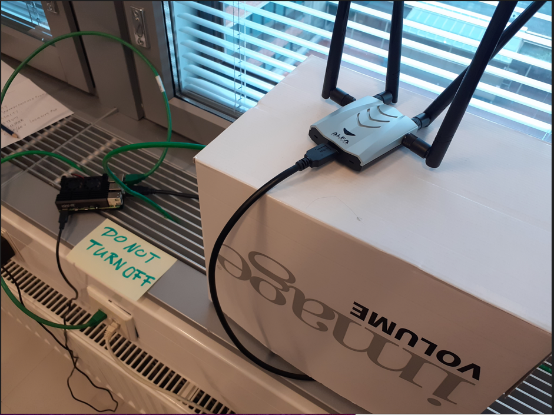

# Initial Setup

The purpose of the project was, at least initially, to create a framework that used collected WiFi device data to generate physical traffic statistics; for example, collecting device identifying data sets from two different physical points, saving them into a database and then crossreferencing them to create numerical data on how many people commuted from point A to point B.

For the initial setup and development of software and scripts, we set out to setup a Raspberry Pi device with a connected external WiFi adapter capable of being switched to monitoring mode (in this case an Alfa AWUS1900 card). A raspberry Pi 3 was also borrowed, but later changed to a Raspberry Pi 4B for the added RAM capacity and to solve some compatability issues.

## First setup

At first, we used the Raspberry Pi 3 provided to us by the course teacher, with Debian 11 Bullseye installed on it. The Raspberry was brought to the Servula lab on Pasila campus, and given a static IP address on the lab network courtesy of the teachers. The purpose of holding the RPI at the lab environment was to allow for easy remote access for both project members at seperate times. After setting the RPI up at the lab and it's initial configuration, the Alfa card was connected, and required drivers were installed.

Along with the Alfa card drivers, the following software packages were installed:
- wget
- xz utils
- net-tools
- usbutils
- dkms
- wireless-tools
- python3-pip
- airmon-ng
- aircrack-ng
- probequest
- python3-scapy libraries

Using the command `airmon-ng start wlan1` (wlan0 was the internal wifi adapter of the RPI) successfully turned the alfa card to monitoring mode at this point. However, trying to launch probequest resulted in a collection of Scapy errors. Extensive troubleshooting by both project members could not come up with a solution to fix them, so at this point we decided to upgrade to a Raspberry Pi 4B used by Jaakko for better technical specs, and install Kali Linux on it at the same time.

## Second Setup

With the Raspberry 4B set up, with Kali Linux installed, using the same IP address as was provided for the RPI3, much less software was needed to install, as many of the utilities came pre-packaged with Kali. The RPI4 still needed installation of Alfa card's drivers, along with Python3-Scapy libraries to make Probequest work.

## Feasilibility Test

After setting the Alfa card to monitoring mode, the command `probequest wlan1` set probequest to sniffing probe frames sent out by wifi devices within the card's signal range. Sample of the printout below:

`10:22:03 UTC - xx:xx:xx:xx:xx:1e (Unknown OUI) -> <wlan SSID 1>
 10:22:05 UTC - xx:xx:xx:xx:xx:71 (Unknown OUI) -> homerun1x
 10:22:05 UTC - xx:xx:xx:xx:xx:71 (Unknown OUI) -> homerun1x
 10:22:24 UTC - xx:xx:xx:xx:xx:1b (Unknown OUI) -> homerun1x
 10:22:24 UTC - xx:xx:xx:xx:xx:4c (Unknown OUI) -> homerun1x
 10:22:37 UTC - xx:xx:xx:xx:xx:3d (Unknown OUI) -> homerun1x
 10:22:47 UTC - xx:xx:xx:xx:xx:e3 (Unknown OUI) -> <wlan SSID 2>
 10:22:49 UTC - xx:xx:xx:xx:xx:fa (Unknown OUI) -> homerun1x
 10:22:49 UTC - xx:xx:xx:xx:xx:fa (Unknown OUI) -> homerun1x
 10:22:59 UTC - xx:xx:xx:xx:xx:e3 (Unknown OUI) -> <wlan SSID 2>
 10:22:59 UTC - xx:xx:xx:xx:xx:02 (Unknown OUI) -> <wlan SSID 3>
 10:23:03 UTC - xx:xx:xx:xx:xx:e3 (Unknown OUI) -> <wlan SSID 2>
 10:23:09 UTC - xx:xx:xx:xx:xx:7e (Unknown OUI) -> homerun1x
 10:23:09 UTC - xx:xx:xx:xx:xx:7e (Unknown OUI) -> homerun1x
 10:23:09 UTC - xx:xx:xx:xx:xx:7e (Unknown OUI) -> homerun1x
 10:23:10 UTC - xx:xx:xx:xx:xx:b6 (Times N System, Inc.) -> <wlan SSID 4>
 10:23:10 UTC - xx:xx:xx:xx:xx:b6 (Times N System, Inc.) -> <wlan SSID 5>
 10:23:14 UTC - xx:xx:xx:xx:xx:b0 (Unknown OUI) -> homerun1x
 10:23:15 UTC - xx:xx:xx:xx:xx:30 (Unknown OUI) -> homerun1x
 10:23:16 UTC - xx:xx:xx:xx:xx:b6 (Times N System, Inc.) -> <wlan SSID 2>
 10:23:20 UTC - xx:xx:xx:xx:xx:b6 (Times N System, Inc.) -> <wlan SSID 4>
 10:23:20 UTC - xx:xx:xx:xx:xx:b6 (Times N System, Inc.) -> <wlan SSID 6>
 10:23:20 UTC - xx:xx:xx:xx:xx:b6 (Times N System, Inc.) -> <wlan SSID 5>
 10:23:21 UTC - xx:xx:xx:xx:xx:b6 (Times N System, Inc.) -> <wlan SSID 4>
 10:23:21 UTC - xx:xx:xx:xx:xx:b6 (Times N System, Inc.) -> <wlan SSID 6>`
 
 As can be seen from the printout, the information collected from the probeframes is the mac address generated by the device for a network connection, a manufacturer associated with the manufacturer ID portion of the MAC address, and the SSID of a network it is trying to connect to.
 
 This did, however, bring on a revelation. Our initial impression of how probeframes worked, was that wifi-equipped devices (primarily phones) would be sending out probeframes actively to try to find networks within their range. Instead, they are trying to find networks they have previously been connected to. Since it can be presumed that with the advent of unlimited data caps in most mobile phone subscriptions many mobile devices might never have even connected to a wifi network (much like Jaakko's current phone), this significantly lessened the size of the data set from what was expected, to the point it is likely unviable for the initial project plan. The low amount of unique devices that appeared on the printout during the testing period in spite of the receiver being located in a relatively busy region seems to support this hypothesis as well.
 
